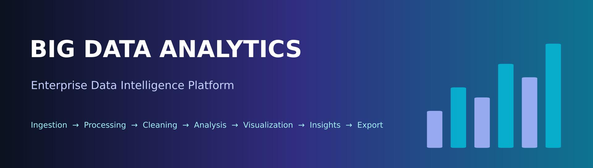
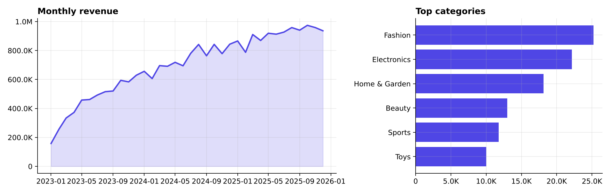
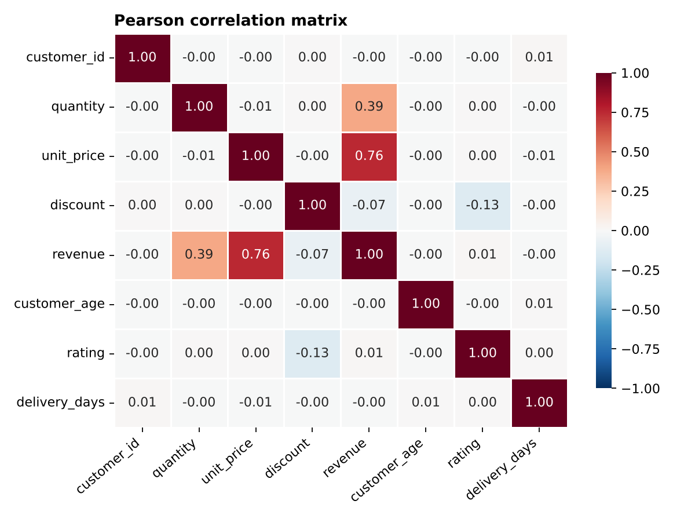
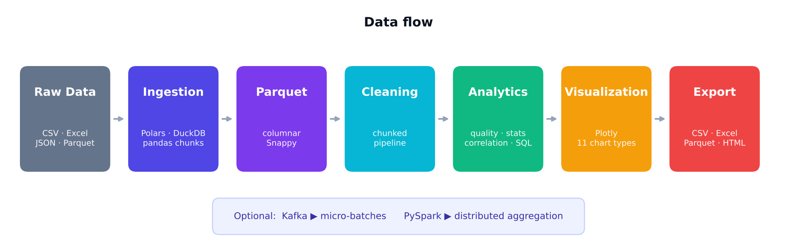
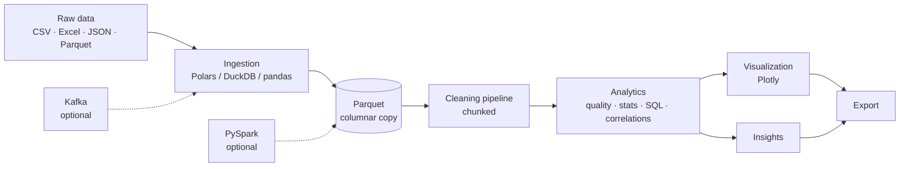

<div align="center">



# 📊 Big Data Analytics Dashboard

**An enterprise-style analytics platform that covers the complete big-data workflow —
from raw files to clean data, interactive charts, insights and exports.**


[Features](#-features) · [Preview](#-preview) · [Quick start](#-quick-start) · [Architecture](#-architecture) · [Project structure](#-project-structure) · [Troubleshooting](#-troubleshooting)

</div>

---

## 📖 Table of contents

1. [Overview](#-overview)
2. [Preview](#-preview)
3. [Features](#-features)
4. [Architecture](#-architecture)
5. [How big data is handled](#-how-big-data-is-handled)
6. [Tech stack](#-tech-stack)
7. [Quick start](#-quick-start)
8. [Usage walkthrough](#-usage-walkthrough)
9. [Pages](#-pages)
10. [Data quality score](#-data-quality-score)
11. [Project structure](#-project-structure)
12. [Configuration](#-configuration)
13. [Example dataset](#-example-dataset)
14. [Adding your own screenshots](#-adding-your-own-screenshots)
15. [Troubleshooting](#-troubleshooting)
16. [Roadmap](#-roadmap)
17. [License](#-license)

---

## 🔭 Overview

The **Big Data Analytics Dashboard** is a Streamlit application that ingests CSV, Excel, JSON and Parquet files, measures data quality, runs a chunked cleaning pipeline with a live monitor, profiles the data, builds interactive charts, finds correlations, writes plain-language insights and exports the results.

It is designed to stay responsive on large files: instead of loading everything into memory it **streams, samples and aggregates before plotting**, and it falls back to plain pandas if Polars, DuckDB or PyArrow are not available.

> ✅ Runs 100 % locally — no paid APIs, no external AI services.

---

## 🖼️ Preview

> The images below were rendered from the built-in sample dataset (100,000 records) using the app's own analysis code. See [Adding your own screenshots](#-adding-your-own-screenshots) to replace them with real screenshots of the running app.

### KPI dashboard
All eight KPI cards are calculated dynamically from the loaded dataset.


### Data quality
Five dimensions combined into one global score.


### Processing monitor
Live progress, records processed / remaining, rows per second and stage status.


### Trends and categories



### Correlation analysis

<p align="center"></p>

---

## ✨ Features

### 📥 Data ingestion
- Upload **CSV, TSV, Excel (.xlsx/.xls), JSON, JSONL and Parquet**
- Load huge files **straight from disk** without passing through the browser
- Automatic delimiter and date detection, friendly errors for empty or corrupt files
- Shows filename, size, records, columns, data types, load time and the engine used
- Built-in **sample data generator** (10 k → 2 M records)
- Searchable, sortable, filterable, paginated data preview

### 🛡️ Data quality
- Five dimensions: **Completeness · Accuracy · Consistency · Uniqueness · Validity**
- Global **0–100 score** with an explainable formula
- Issue table: missing values, duplicates, invalid values, empty columns, wrong types, outliers
- Column-level report and one-click fix for mis-typed columns

### ⚙️ Processing & cleaning
- **Chunked pipeline** with a live monitor (progress, speed, remaining records, stage badges)
- Missing values: *remove, mean, median, mode, forward fill, backward fill, custom value*
- Duplicate detection on all or selected columns
- Type detection and conversion: *Integer, Float, String, Boolean, Date, Datetime, Category*
- Outliers: **IQR** or **Z-score** → cap, remove or flag
- Full change log and *Reset to original*

### 🔍 Exploratory analysis
- Numerical: mean, median, std, variance, min/max, percentiles, IQR, skew, kurtosis
- Categorical: unique values, top categories, frequency, distribution
- Temporal: **daily, weekly, monthly and yearly** trends

### 📈 Visualization Studio
- **11 chart types** — Bar, Line, Area, Scatter, Histogram, Box, Heatmap, Pie, Treemap, Sunburst, Time Series
- X axis · Y axis · Group by · Color · **Aggregation** (Sum, Mean, Median, Count, Min, Max, Unique count) · Filters
- Zoom, pan, hover, legend toggling, PNG download
- Data is binned/aggregated *before* plotting, so charts stay fast on millions of rows

### 🧮 Big Data stats
- Engine status (Polars, PyArrow, DuckDB, PySpark, Kafka)
- Memory footprint per column, Parquet compression ratio
- Normality diagnostics
- Read-only **SQL console** (DuckDB, SQLite fallback)
- Optional **PySpark** and **Kafka** adapters

### 🔗 Correlations
- Pearson, Spearman and Kendall
- Interactive heatmap and strongest positive / negative pairs
- Pair explorer with a statistical test and plain-language reading

### 💡 Insights
- Automatic findings grouped by *Data health, Distribution, Relationships, Trends, Segments*
- Severity levels and recommended actions
- The word *“significant”* is used **only when a test was actually run**

### 💾 Export
- Clean data as **CSV, Excel, JSON, Parquet**
- Statistics, correlation matrix and quality report as CSV
- Standalone **HTML report**
- Charts as HTML / PNG

---

## 🏗️ Architecture





**Design rule:** `services/` contains all data logic and never imports UI code, so it can be tested or reused from a notebook.

---

## 🚀 How big data is handled

| Technique | What it does |
| --- | --- |
| **Streaming readers** | Polars lazy scan → DuckDB → chunked pandas (first one available) |
| **Exact count + uniform sample** | Files above the in-memory limit (default **2 M rows**) are sampled; the exact record count is still displayed |
| **Parquet** | Columnar, Snappy-compressed copy stored in `data/processed/` |
| **Chunked cleaning** | The pipeline processes `BDA_CHUNK_SIZE` rows at a time |
| **Bounded estimates** | Costly checks (text validity, correlations) run on capped samples |
| **Aggregate before plotting** | Histograms binned in NumPy, bars/lines aggregated, scatter capped at 50 k points |
| **Graceful fallback** | No Polars / DuckDB / PyArrow? The app keeps working with pandas |

---

## 🧰 Tech stack

| Layer | Technology |
| --- | --- |
| UI | Streamlit, custom CSS |
| Data | pandas, NumPy, **Polars**, **PyArrow**, **DuckDB** |
| Charts | Plotly (interactive), Matplotlib + Seaborn (static exports) |
| Statistics | SciPy |
| Files | OpenPyXL, xlrd |
| Optional | PySpark, kafka-python, kaleido |

---

## ⚡ Quick start

```bash
# 1. Clone
git clone https://github.com/<your-username>/big-data-analytics-dashboard.git
cd big-data-analytics-dashboard

# 2. Create a virtual environment
python -m venv .venv
source .venv/bin/activate        # Windows: .venv\Scripts\activate

# 3. Install
pip install -r requirements.txt

# 4. Run
python -m streamlit run app.py
```

Open **http://localhost:8501**.

> 💡 On Windows, `python -m streamlit run app.py` works even when the `streamlit` command is not on your `PATH`.

Optional integrations:

```bash
pip install -r requirements-optional.txt   # PySpark (needs Java 11+) and kafka-python
```

---

## 🧭 Usage walkthrough

1. **📥 Data Ingestion** — upload a file, load one from disk, or generate the sample dataset.
2. **🛡️ Data Quality** — read the score and the issue list.
3. **⚙️ Processing** — press **▶ Run pipeline**, or fix things manually with the cleaning tools.
4. **🔍 Exploratory Analysis** — profile numbers, categories and time trends.
5. **📈 Visualization Studio** — build charts with filters and aggregations.
6. **🔗 Correlations**, **💡 Insights**, **🧮 Big Data Stats** — dig deeper.
7. **💾 Export** — download clean data, tables, the HTML report and charts.

---

## 📑 Pages

| Page | Purpose |
| --- | --- |
| 🏠 Dashboard | KPIs, pipeline status, quality ring, top insights, overview charts |
| 📥 Data Ingestion | Upload / load from disk / generate sample, preview |
| 🛡️ Data Quality | Quality dimensions, issues, column report, outliers |
| ⚙️ Processing | Pipeline monitor and cleaning tools |
| 🔍 Exploratory Analysis | Numerical, categorical and temporal profiling |
| 📈 Visualization Studio | Interactive chart builder |
| 🧮 Big Data Stats | Engines, footprint, diagnostics, SQL, Spark & Kafka |
| 🔗 Correlations | Matrices, heatmap, strongest pairs, pair test |
| 💡 Insights | Automatic findings with severity and actions |
| 💾 Export | Data, analysis, report and chart downloads |

---

## 🎯 Data quality score

| Dimension | Weight | How it is measured |
| --- | :---: | --- |
| **Completeness** | 25 % | Share of non-missing cells |
| **Accuracy** | 20 % | Numeric values not beyond 3×IQR fences *(a proxy — extreme ≠ wrong)* |
| **Consistency** | 15 % | Text free of case / whitespace variants and mixed types |
| **Uniqueness** | 20 % | Share of rows that are not exact duplicates |
| **Validity** | 20 % | Values matching the column's evident type (e.g. no `N/A` in a numeric column) |

| Score | Label |
| :---: | --- |
| 90 – 100 | 🟢 Excellent |
| 75 – 89 | 🔵 Good |
| 60 – 74 | 🟠 Fair |
| < 60 | 🔴 Poor |

---

## 🗂️ Project structure

```text
big_data_analytics/
├── app.py                      # entry point, CSS, routing, global error guard
├── config.py                   # paths, limits, weights, navigation
├── requirements.txt
├── requirements-optional.txt   # PySpark, Kafka
├── data/
│   ├── raw/                    # uploaded originals
│   ├── processed/              # Parquet output
│   └── sample/                 # sample_transactions.csv
├── pages/                      # one render() per page
│   ├── dashboard.py            ├── data_ingestion.py
│   ├── data_quality.py         ├── processing.py
│   ├── exploratory_analysis.py ├── visualization.py
│   ├── big_data_stats.py       ├── correlations.py
│   └── insights.py             └── export.py
├── components/                 # sidebar, navbar, kpi_cards, charts, tables, metrics
├── services/                   # ingestion, cleaning, data_quality, processing, analytics
├── utils/                      # helpers, validators, formatters
├── assets/                     # style.css, logo.png
└── docs/images/                # README images
```

---

## ⚙️ Configuration

| Environment variable | Default | Meaning |
| --- | --- | --- |
| `BDA_MAX_ROWS` | `2000000` | Rows kept in memory; larger files are sampled |
| `BDA_CHUNK_SIZE` | `250000` | Rows per chunk in readers and the pipeline |
| `BDA_ANALYSIS_SAMPLE` | `200000` | Rows used for expensive estimates |

```bash
# Example (Windows PowerShell)
$env:BDA_MAX_ROWS = 5000000
python -m streamlit run app.py
```

---

## 🧪 Example dataset

`data/sample/sample_transactions.csv` (5,000 rows) is included. The in-app generator can create up to **2,000,000** records of synthetic e-commerce transactions with deliberate flaws so every feature has something to show:

- ❓ missing ages and ratings
- ♊ exact duplicate rows
- 📌 extreme revenue and delivery-time outliers
- 🔤 inconsistent country spellings (`france`, `Spain `)
- 📅 timestamps with a growth trend

---

## 📸 Adding your own screenshots

1. Run the app and open each page.
2. Save screenshots as `docs/screenshots/dashboard.png`, `quality.png`, `processing.png`, `visualization.png`.
3. Replace the preview images in this README, for example:

```markdown

```

---

## 🛠️ Troubleshooting

| Problem | Fix |
| --- | --- |
| `'streamlit' is not recognized` (Windows) | Use `python -m streamlit run app.py` |
| `pip install` fails on polars / pyarrow / duckdb | Remove that line from `requirements.txt` or use Python 3.12 / 3.13 — the app falls back to pandas |
| Parquet features disabled | Install `pyarrow` |
| Out of memory on a huge file | Lower **Max rows kept in memory** in the sidebar settings, or convert the file to Parquet |
| Excel export disabled | Excel is limited to 1,048,575 rows — export CSV or Parquet |
| Chart PNG download missing | `pip install kaleido`, or use the camera icon on the chart |
| Dates are treated as text | Processing → Cleaning tools → Data types → convert to Date / Datetime |
| Page shows `missing ScriptRunContext` warnings | The file was run with `python app.py`; use `python -m streamlit run app.py` |

---

## 🗺️ Roadmap

- [x] Multi-format ingestion with streaming and sampling
- [x] Chunked cleaning pipeline with live monitor
- [x] Five-dimension data-quality score
- [x] 11-chart Visualization Studio
- [x] SQL console (DuckDB)
- [x] Optional PySpark and Kafka adapters
- [ ] Run the Spark adapter against a real cluster
- [ ] Persist Kafka micro-batches as partitioned Parquet
- [ ] Scheduled pipelines and saved cleaning recipes
- [ ] Forecasting, clustering and anomaly detection
- [ ] Database connectors (PostgreSQL, BigQuery, Snowflake)
- [ ] Automated test suite and CI

---

## 📝 Notes on statistics

- Correlation does not imply causation.
- With very large *n*, even tiny effects become statistically significant — look at effect sizes, not only p-values.
- The SQL console is read-only and intended for local use.

---

## 📄 License

Released under the [MIT License](LICENSE).

<div align="center">

⭐ If this project helps you, consider giving it a star on GitHub.

</div>
